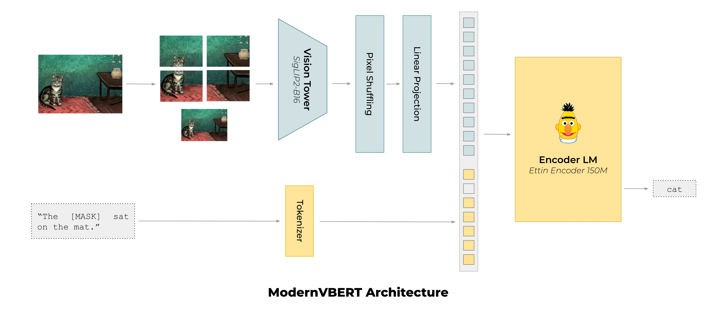

# *ModernVBERT*: Towards Smaller Visual Document Retrievers 👁️


[](https://arxiv.org/abs/2510.01149) [](https://huggingface.co/ModernVBERT) [](https://huggingface.co/blog/paultltc/modernvbert)


This repository contains the configurations and scripts used for training the models in the [*ModernVBERT*: Towards Smaller Visual Document Retrievers](https://arxiv.org/abs/2510.01149) paper.

### Abstract

Multimodal embedding models are gaining prevalence, notably for document retrieval as efficient alternatives to text-only pipelines. These models are typically built by finetuning large vision–language decoders (VLMs) with contrastive losses on text–image pairs. In this work, we show that, while cost-efficient, this repurposing approach often bottlenecks retrieval performance. 
Through controlled experiments, we establish a principled recipe for improving visual document retrieval models. We notably measure the impact of attention masking, image resolution, modality alignment data regimes, and late interaction centered contrastive objectives which emerge as central performance factors. 
Building on these insights, we release *ModernVBERT*, a compact 250M-parameter vision–language encoder that outperforms models up to 10 times larger when finetuned on document retrieval tasks.



## Codebase
> ⚠️ Might not be stable while all branches/fork are not merged into various trainers. We recommend using one environment per trainer as there might be conflicts in package versions.
- `src/modality_alignment`: Modality alignment configs and scripts. Uses [our fork of `m4`](https://github.com/paultltc/smollm/tree/main/vision/m4) as trainer.
- `src/contrastive_training`: Contrastive training configs and scripts. Uses the contrastive trainer from [the branch `vbert` of `colpali_engine`](https://github.com/illuin-tech/colpali/tree/vbert).
- `src/models`: Contains the modelings of ModernVBERT and the ablation models.
- `src/natcap`: Contains the scripts used to generate the dataset `NatCap`.

## Example
We provide a notebook as an example for finetuning ModernVBERT. It contains all the information required to launch a model post-training.

[Go to Tutorial](https://colab.research.google.com/drive/1bT5LWeO1gPL83GKUZsFeFEleHmEDEQRy)

## Ressources

- 📄 Paper: https://arxiv.org/abs/2510.01149
- 🤗 HF Org: https://huggingface.co/ModernVBERT
- 🌐 Blog: https://huggingface.co/blog/paultltc/modernvbert

## Contact of the authors

- Paul Teiletche: paul.teiletche@epfl.ch
- Quentin Macé: quentin.mace@illuin.tech
- Max Conti: max.conti@illuin.tech
- Manuel Faysse: manuel.faysse@centralesupelec.fr


## Citation

If you use any datasets or models from this organization in your research, please cite the original dataset as follows:

```latex
@misc{teiletche2025modernvbertsmallervisualdocument,
      title={ModernVBERT: Towards Smaller Visual Document Retrievers}, 
      author={Paul Teiletche and Quentin Macé and Max Conti and Antonio Loison and Gautier Viaud and Pierre Colombo and Manuel Faysse},
      year={2025},
      eprint={2510.01149},
      archivePrefix={arXiv},
      primaryClass={cs.IR},
      url={https://arxiv.org/abs/2510.01149}, 
}
```

## Acknowledgments

This work was carried out within the framework of the LIAGORA "LabCom", a joint laboratory supported by the French National Research Agency (ANR) and established between ILLUIN Technology and the MICS laboratory of CentraleSupélec. This work was performed using HPC resources from IDRIS with grant AD011016393. We warmly thank Hippolyte Gisserot-Boukhlef and Nicolas Boizard for sharing the controlled experiments LM checkpoints, Antoine Chaffin for his feedback on the modality alignment codebase and insights on Ettin’s modeling, as well as Andi Marafioti, Orr Zohar, and Miquel Farré for their valuable input and help on gathering the modality alignment dataset.